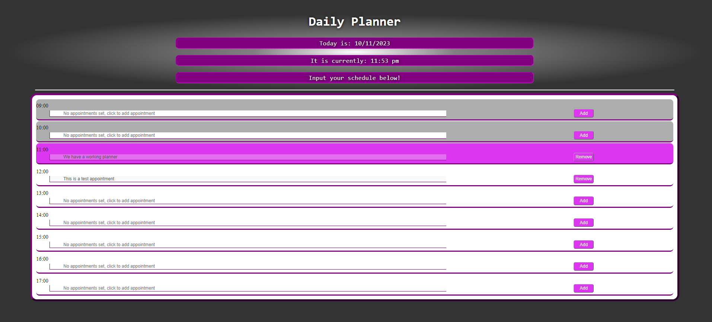

# Planner Application

This project is designed to help organise and structure a working life. The app will utilise local storage to hold data inputted by the user, have the ability to display those pieces of information in time blocks which correspond to both the specific date and time duration, and have the ability to remove that data as well. 

# Front End

- HTML
- CSS
- Javascript
- jQuery
- dayJs

# Usage 

Visit this page at: https://jaycossey.github.io/planner-application/

# Support 

For support please contact me via https://github.com/Jaycossey

# License

See License for details